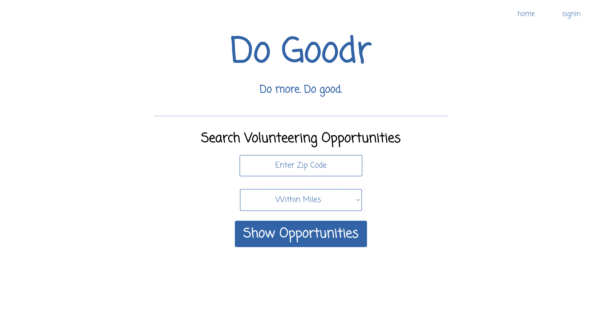
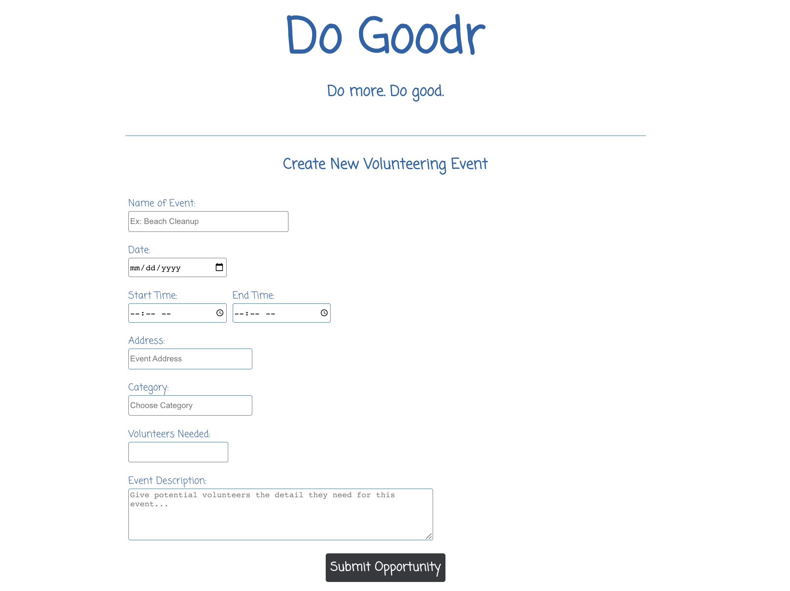
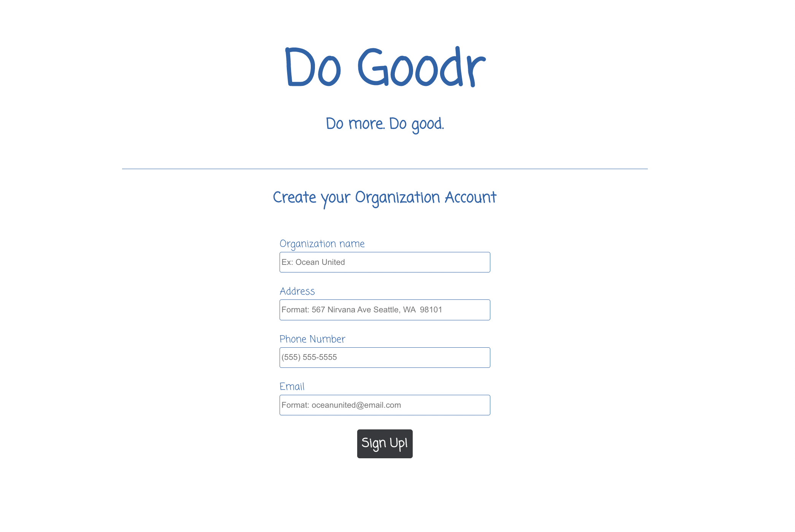
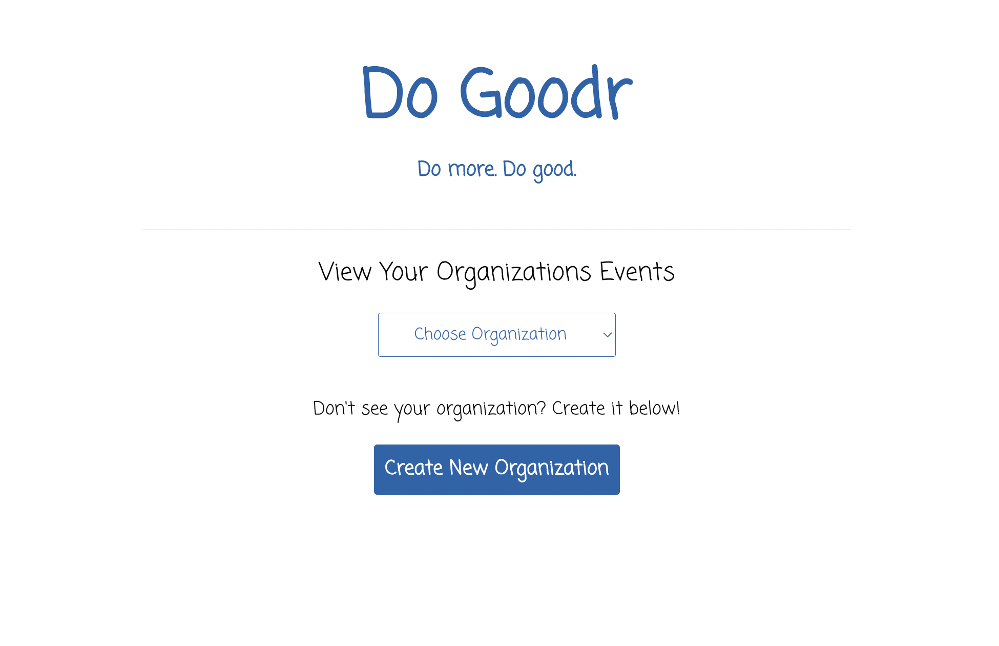
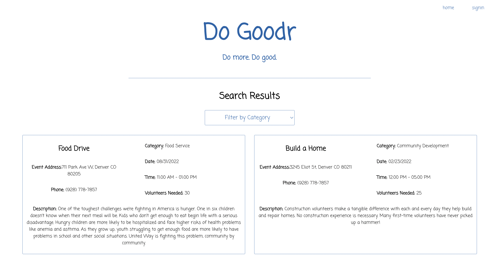
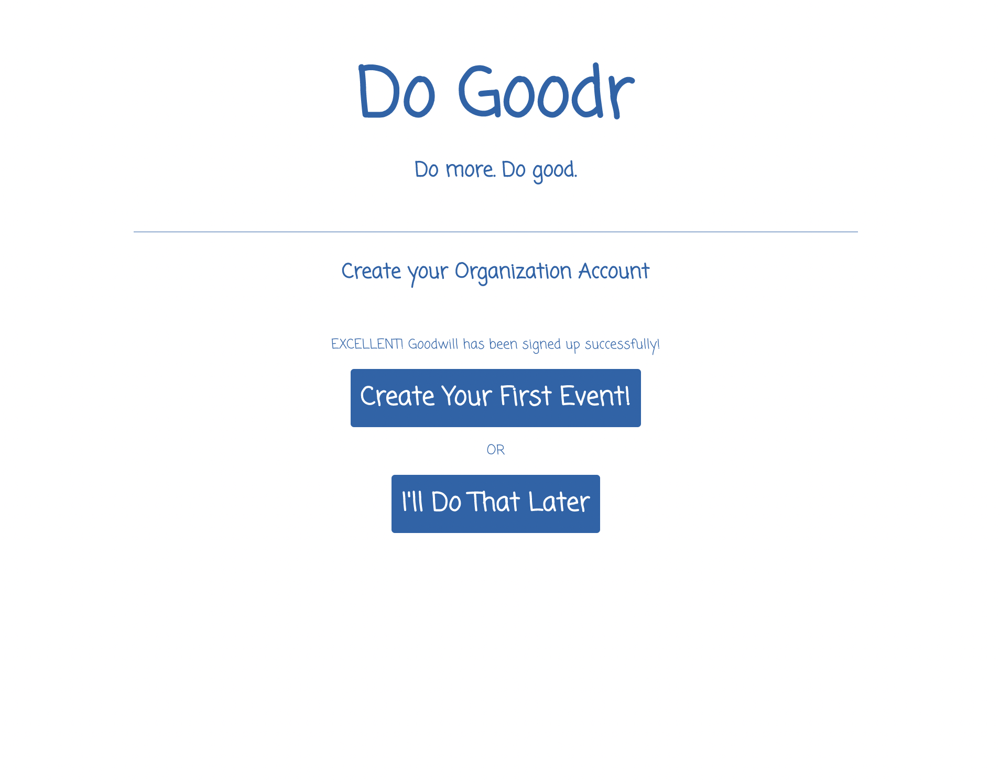

# Do Goodr - by Michele Comfort, Adam Burgess, Colgan Meanor, Matt Holmes, Ted Staros
Mod4 2108 Cohort

Deployed Link: [Click Here to Try Do Goodr](https://do-goodr-fe.herokuapp.com/)

#### Application Preview  

## Table of Contents
  - [Install + Setup](#set-up)
  - [Project Specs](#project-specs)  
  - [Abstract](#abstract)
  - [Architecture](#architecture)
  - [Technologies](#technologies)
  - [Contributors](#contributors)
  - [Wins](#wins)
  - [Challenges + Improvements](#challenges-+-Improvements)
  

## Install + Setup
  - clone this repo: [here](https://github.com/Do-Goodr/do-goodr-fe)
   - On the command line, type: **$ npm install**
   - On the command line, type: **$ npm start**
   - The app will run on port 5000.
   - Visit (http://localhost:5000/) in your browser. 

## Project Specs
   - The project spec & rubric can be found [here](https://mod4.turing.edu/projects/capstone/)

## Abstract

  Do Goodr is an application designed to help people find volunteer opportunities in their local areas. The truth is that many of us are looking for ways to give back to our communities, and searching online for local volunteer opportunities can be cumbersome, and disorganized. Thus, Do Goodr was born out of a desire to solve this problem. General users will have the ability to search for volunteer events or opportunities in their area by performing a search based on their zip code and the distance in miles from their desired zip code. Meanwhile, an organization has the ability to register their organization to the app to post new events or opportunities that will appear when users are searching for opportunities in their local area. 

#### Main Dashboard

#### Create Event Form

#### Create Organization Form

#### Organization Sign-In

#### Zip Code/Mileage Search Results

#### Successful Organization Creation

## Architecture

  The front end component of this app was developed using the React Framework, along with Typescript, HTML, CSS, and tested via Cypress Testing Framework.    

  All data for Do Goodr is housed in a separately deployed back-end component for the project which can be found [here](https://github.com/Do-Goodr/do-goodr-be). When users are choosing an organization to make posts as, the front end application is fetching all of the organizations housed in the back end server to populate a dropdown menu with the choices of organization names. When an organization is posting an event, it is posted to the back end server and that post will be fetched from the back end to appear for other users if they are searching for events in the same area. In general, data comes to the front end from the back end only when it is explicitly requested via user actions and interactions. When data lands in the front end application, it is held in state and distributed as necessary to relevant React child components. 

## Technologies
  - 
  - 
  - 
  - 
  - 
  - 
  - 
  - 
  - 
  - 
  - 

## Contributors
  - [Michele Comfort](https://github.com/michelecomfort)
  - [Adam Burgess](https://github.com/aburg15)
  - [Colgan Meanor](https://github.com/colganmeanor)

## Wins
  - As a team of front-end and back-end engineers, we conceptualized and designed the entire application from idea/planning stage to completion. 
  - Successfully built using Typescript in place of vanilla Javascript. 
  - Successfully implemented continous integration building via CircleCI and automatic deployment to Heroku upon successful builds in working/Beta development branch. 
  
  

## Challenges + Improvements
  - Setting up CircleCI continuous integration in the early stages of the project was a bit challenging. But it was a productive process to engage in earlier rather than later in the project. 
  - Sketching out functionality and responsibilities could be challenging at times with our joint FE and BE teams, but it got easier over time as we grew more comfortable with having conversations about what can and cannot be done respectively by both teams. 
  
  
